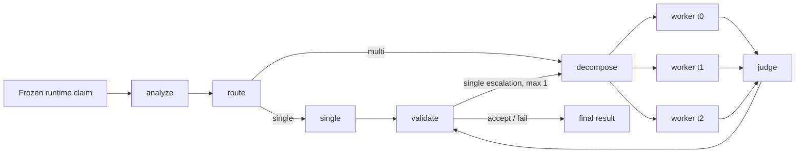

# EvidenceRoute

成本感知的自适应事实核查 Agent：在同一冻结证据与模型配置下选择 single 或 multi 路径。

## What Is Implemented

- 严格 Pydantic 运行契约与无 gold 泄漏的 runtime/scorer manifest 边界。
- 冻结 AVeriTeC 证据上的 claim-local BM25 检索与可校验数据来源。
- 规则优先、LLM 兜底的 adaptive router，以及 fixed single/fixed multi 对照策略。
- LangGraph 有界执行图：最多 3 个并行 worker，single 路径最多升级一次。
- SQLite 幂等调用缓存、整数 micro-CNY 预算预留、usage/账单不确定性安全停止。
- 32 条 train-only calibration 保存结果重放，54 个候选策略零额外模型调用筛选。
- 80 条 dev 三策略交错评测、20 条三次重复稳定性评测及可恢复 campaign。
- 全 manifest 指标、completed-only 官方 evaluator、bootstrap/Wilson 区间和确定性报告。

## Architecture



运行图只读取 claim-only manifest。Gold、官方 evaluator 与报告在独立 scorer 边界中使用。

## Quick Start

要求 Python 3.11。

```powershell
python -m pip install -r requirements.lock
python -m pip install -e . --no-deps
$env:EVIDENCE_ROUTE_API_KEY = "<your-key>"
$env:EVIDENCE_ROUTE_BASE_URL = "<openai-compatible-base-url>"
$env:EVIDENCE_ROUTE_MODEL = "<requested-model-alias>"
$env:EVIDENCE_ROUTE_PRICE_FILE = "configs/pricing.local.yaml"
evidence-route --help
```

提供方是 OpenAI-compatible provider。报告中的模型 ID 是中转服务自报值，
`identity unverified`，不表示由任何模型厂商认证。

## Prepare The Frozen Benchmark Subset

```powershell
python scripts/prepare_averitec.py `
  --source-spec data/sources/averitec.json `
  --output-root data/processed/averitec `
  --runtime-manifest-root data/manifests `
  --scorer-manifest-root data/scorer_manifests `
  --seed 20260817 `
  --calibration-per-label 8 `
  --dev-per-label 20 `
  --stability-per-label 5
```

下载语料保存在忽略目录 `data/processed/`，仓库只提交 manifest、来源锁定信息和校验值。

## Verify One Claim

```powershell
evidence-route verify `
  --claim-id dev-0 `
  --claim "A claim to verify" `
  --strategy adaptive `
  --config configs/default.yaml `
  --pricing configs/pricing.local.yaml `
  --corpus-dir data/processed/averitec/corpora
```

每个结果包含状态、四分类 verdict、引用、usage、成本身份和错误码。账单不确定、usage 缺失
或模型 ID 漂移会停止 campaign，不会被改写成预测标签。

## Run Calibration And Evaluation

不带付费确认时，命令只输出 base/repair/fault 上界和启动预算，不构造网络 transport。

```powershell
evidence-route calibrate --help
evidence-route evaluate --help
evidence-route report --help
```

冻结评测名称固定为 `AVeriTeC dev balanced subset (n=80)`。运行顺序为 train calibration
收集、保存结果 replay、冻结策略、三策略交错 dev、adaptive stability、报告发布。

## Results

<!-- EVIDENCE_ROUTE_RESULTS_START -->
Final frozen run not generated yet. Do not quote design targets as measured results.
<!-- EVIDENCE_ROUTE_RESULTS_END -->

这里的结果不是官方 leaderboard 成绩。只有完整 campaign 通过发布门禁后，报告命令才会从
`summary.json` 同步更新此区块和简历片段。

## Artifact And Metric Definitions

- Headline quality：80 条完整 manifest 的 macro-F1；partial、failed 和 missing 均按无预测惩罚。
- Completed-only：只对合法 completed 输出运行固定的 2024 shared-task evaluator，并同时报告分母。
- Cost：由 provider usage 与冻结 CNY 价格配置计算，所有预算比较使用整数 micro-CNY。
- Latency：P50/P95 只使用 fresh end-to-end latency；checkpoint downtime 与 cache hit 单列。
- Stability：20 条 claim 的 adaptive repeat 0/1/2 verdict 一致率和 Wilson 区间。

## Reproducibility

- 数据、NLTK 资产、官方 evaluator、prompt、配置、价格和依赖均有固定 revision/hash。
- 每个 run/campaign/artifact 使用确定性 ID 与 canonical JSON SHA-256。
- 付费调用共用一个 SQLite ledger；恢复不会重复计算已完成调用的 usage 或成本。
- 默认测试禁止网络；`network`、`live`、`paid` 必须显式标记。

## Limitations

- 评测是平衡冻结子集，不代表完整 benchmark 分布。
- 模型身份由中转服务自报，未经过供应商认证。
- 3 个百分点质量容差和 85% 稳定性是工程门禁，不是统计非劣效性结论。
- MCP、中文案例与 Streamlit 属于尚未实现的 Gate B，不在当前能力或结果中。

## License And Data Attribution

EvidenceRoute 项目代码采用 MIT License。AVeriTeC 数据与固定 evaluator 保持其 CC BY-NC 4.0
条款，不因本仓库而重新许可。详见 [THIRD_PARTY_NOTICES.md](THIRD_PARTY_NOTICES.md)。
