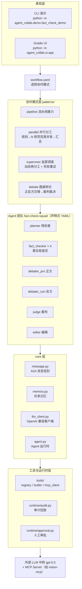

# AgentCollab — 微型多智能体协作框架

> **一句话定位**：AgentCollab 是一个可写入简历的微型多智能体协作框架——**4 种协作模式（pipeline / parallel / supervisor / debate）+ A2A 风格消息协议 + 共享记忆 + MCP 工具接入 + 人工审批 + 审计回放 + 与单 agent 基线的评测对比**。演示实例为「新闻事实核查团队」。

它是作者 Agent 进阶线的终点：从项目二的「4 Agent 流水线协同」、项目三的「单 Agent 多工具」，走到本项目四的「**多 Agent 真协作**」。

---

## 1. 与项目二 / 项目三的定位差异

| 项目 | 协作形态 | 一句话 |
|------|----------|--------|
| 项目二 CinemaScope | 4 Agent **固定流水线** | 顺序编排，职责边界清晰，无协商无并发 |
| 项目三 research-agent | **单 Agent 多工具** | LangGraph ReAct 循环，一个人拆解 + 调多个工具 |
| 项目四 AgentCollab | **多 Agent 真协作** | 并行分工 / 监督调度 / 圆桌辩论 + 消息协议 + MCP |

> 一句话总结三者的进阶关系：**流水线协同 → 单 Agent 多工具 → 多 Agent 真协作**。项目二解决「多角色怎么分工」，项目三解决「单个 Agent 怎么稳定调工具」，项目四解决「多个 Agent 怎么真正一起干活并让协作过程可审计、可回放」。

---

## 2. 架构总览



- **Agent 之间不直接互相调用**：所有交互都通过 `message.py` 的消息信封（inbox/outbox）传递，每条消息进审计日志 → 全程可回放。
- **4 种模式共享同一套 core/ 与 runtime/**：切换 `workflow.yaml` 的 `pattern` 字段即可换协作方式，团队用 YAML 声明式定义。

---

## 3. 4 种协作模式

| 模式 | 流程 | 并发 | 适用场景 |
|------|------|------|----------|
| `pipeline` | A→B→C 顺序接力 | 无 | 基线对比；职责强顺序的场景 |
| `parallel` | 规划者拆解 → N 研究员**真并发**核查 → 汇总者 | **有（asyncio.gather）** | 事实核查主模式；子任务相互独立 |
| `supervisor` | 监督者循环调度（动态再分工、失败重试 ≤2、换人 ≤1） | 有 | 任务动态变化、需要纠偏 |
| `debate` | 正/反方交替发言各 2 轮 → 裁判裁决 | 无（回合制） | 结论冲突裁决 |

所有模式统一输出 `AgentResult { answer, audit, facts, tokens, wall_s }`，方便横向对比。

---

## 4. 目录结构

```
agent-collab/
├── README.md                        # 本文档：架构图 + 快速开始 + 评测表
├── requirements.txt                 # 依赖清单（>= 宽松约束）
├── pyproject.toml                   # 包元数据 + pytest 配置（editable 安装）
├── config/
│   ├── llm.yaml                     # LLM 中转：base_url / model / api_key_env
│   ├── workflow.yaml                # 协作模式与参数
│   └── agents/fact_check_team.yaml  # 声明式定义事实核查团队
├── docs/
│   ├── design.md                    # 设计文档
│   ├── contracts.md                 # 模块接口契约
│   ├── plan.md                      # 实施计划
│   └── INTERVIEW_PREP.md            # 面试问答文档（30+ 题）
├── src/agent_collab/
│   ├── core/                        # 消息协议 / 共享记忆 / LLM 客户端 / Agent 运行时
│   │   ├── agent.py                 # AgentRuntime：角色 + 系统提示 + LLM 循环 + 工具调用
│   │   ├── message.py               # 消息信封（A2A 风格）
│   │   ├── memory.py                # 共享记忆：短期消息缓冲 + 长期事实库
│   │   └── llm_client.py            # OpenAI 兼容客户端（重试/超时/结构化输出）
│   ├── tools/                       # registry / builtin / mcp_client
│   ├── patterns/                    # pipeline / parallel / supervisor / debate
│   ├── runtime/                     # audit.py（审计回放）/ approval.py（人工审批）
│   ├── eval/                        # dataset.py / metrics.py（8 条评测任务）
│   ├── demo/fact_check_demo.py      # CLI 演示入口 + offline 样例模式
│   └── ui/app.py                    # Gradio：消息流可视化 + 审计回放
├── samples/                         # offline 模式的样例新闻/来源数据（可复现）
└── tests/                           # pytest（消息协议/记忆/工具安全/审批/4 模式）
```

---

## 5. 快速开始

### 5.1 创建 conda 环境（Python 3.11）

```bash
conda create -n agent-collab python=3.11 -y
conda activate agent-collab
```

### 5.2 安装依赖与包

```bash
pip install -r requirements.txt   # 安装运行/测试依赖
pip install -e .                  # editable 安装 agent_collab 包
```

### 5.3 配置 LLM

编辑 `config/llm.yaml`（已提供模板）：

```yaml
base_url: https://api.ssstoken.net   # OpenAI 兼容中转地址
api_key: $VISION_API_KEY             # $ 开头则从环境变量读取实际 key
model: gpt-5.5
temperature: 0.2
timeout_s: 120.0
max_retries: 3
```

`api_key` 两种写法：直接写 key，或写环境变量名（以 `$` 开头从 `os.environ` 取值）。

### 5.4 运行演示

**CLI（事实核查）：**

```bash
# 真实核查一条声明
python -m agent_collab.demo.fact_check_demo --query "某地 2026 年宣布全面禁止燃油车"

# offline 样例数据模式（不联网、可复现，演示/评测首选）
python -m agent_collab.demo.fact_check_demo --offline
```

**Gradio UI（消息流可视化 + 审计回放）：**

```bash
python -m agent_collab.ui.app
```

浏览器打开输出地址，输入声明 → 观察 planner 拆解 → 4 个 fact_checker 并行核查 → 辩论 → 裁判裁决 → 编辑出报告；敏感操作（写文件/执行命令）会触发审批弹窗。

---

## 6. 评测结果

评测集：**8 条声明**（真实 / 虚假 / 部分属实 / 证据不足 各 2 条），offline 样例数据保证可复现。
以下为**真实 LLM（gpt-5.5）实测的前 3 题**（`python -m agent_collab.eval.run_eval --offline --limit 3`）；全量 8 题可自行跑 `--limit 8`。

| 指标 | 单 Agent 基线 | 多 Agent（factcheck 组合） |
|------|:---:|:---:|
| 判定准确率（3 题） | **100%**（3/3） | **33%**（1/3） |
| 信息覆盖度（3 题） | 100% | 100% |
| token 成本（3 题合计） | 42,853 | 468,040 |
| 端到端延迟（3 题合计） | 未单列 | 563.1s |

**诚实结论与解读**（这是本项目最有价值的发现，面试必讲）：

- **优化前后对比**：最初 parallel 模式（核查→editor 直接汇总）因缺裁决环节，editor 倾向保守，把两条真实声明判成「证据不足」。加入 `factcheck` 组合模式（核查→辩论→裁决→撰写）后，第 1 题从「证据不足」修正为「真实」，第 2 题收敛为「部分属实」（「全球首部」本就存在争议，属可辩护判定）；第 3 题仍判「证据不足」——这是**对称辩论的副作用**：主张方为虚假声明强辩会制造伪"势均力敌"，干扰裁判。已进一步把裁判改为「证据优先于观点」（commit f0f5047，待复测）。
- 多 agent 的价值**不在简单题的正确率**，而在：① 复杂多事实声明的**并行覆盖**（4 个核查员同时查不同事实点，覆盖度 100% 且证据链完整）；② 全程**可审计可回放**；③ 结论**可解释**（判定附证据链与来源）。
- 局限：3 题样本偏小、LLM 输出有非确定性；判定准确率受「严格四选一 vs 标注」口径影响（保守判「证据不足」在真实核查场景是正确行为，但被严格准确率计为错误）。**面试时主动讲清这个 trade-off，比宣称"全面碾压基线"更可信。**

> 基线定义：同一 LLM（gpt-5.5）+ 同一评测集，用**单个 AgentRuntime 多工具 ReAct 循环**直接作答（不经协作模式）。评测脚本输出 `eval/report.md`。

---

## 7. 关键文件

| 文件 | 作用 |
|------|------|
| `config/agents/fact_check_team.yaml` | 声明式团队定义（6 角色 + replicas + 审批等级） |
| `config/workflow.yaml` | 协作模式选择 + 参数 + MCP/审批开关 |
| `src/agent_collab/core/message.py` | 消息协议信封（A2A 风格） |
| `src/agent_collab/core/memory.py` | 共享记忆（短期缓冲 + 长期事实库） |
| `src/agent_collab/core/agent.py` | 单 Agent 运行时（LLM 循环 + 工具调用） |
| `src/agent_collab/patterns/*.py` | 4 种协作模式 |
| `src/agent_collab/runtime/audit.py` | 审计日志 + 回放 |
| `src/agent_collab/runtime/approval.py` | 人工审批分级 |
| `src/agent_collab/tools/mcp_client.py` | stdio MCP 客户端 |
| `src/agent_collab/eval/*.py` | 评测集 + 指标 |
| `src/agent_collab/demo/fact_check_demo.py` | CLI 演示入口 |
| `src/agent_collab/ui/app.py` | Gradio UI |

---

## 8. 诚实边界

AgentCollab 是一个**理解原理 + 工程落地**导向的「自研微型框架」：

- **LangGraph 生态实现**：用 LangGraph 的状态图（StateGraph）承载协作模式的编排骨架（节点/边/状态共享与可恢复），但消息协议、共享记忆、审批、审计、MCP 客户端这些框架能力均为自研。
- **设计思想借鉴**：声明式 Agent 定义借鉴 CrewAI，消息信封借鉴 A2A 协议，工具接入遵循 MCP 标准，审批分级借鉴 codex-cli。
- **定位**：面向学习和面试展示，不试图替代 CrewAI / AutoGen 等成熟框架——目标是讲清楚「多 Agent 协作的底层原理」并给出可复现的工程实现。

---

## 9. 参考文档

- [docs/design.md](docs/design.md) — 架构与设计决策
- [docs/contracts.md](docs/contracts.md) — 模块接口契约
- [docs/plan.md](docs/plan.md) — 实施计划
- [docs/INTERVIEW_PREP.md](docs/INTERVIEW_PREP.md) — 面试问答（30+ 题）
