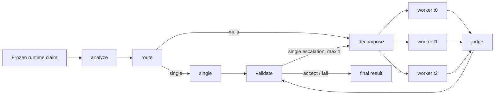

# EvidenceRoute

成本感知的自适应事实核查 Agent：在同一冻结证据与模型配置下选择 single 或 multi 路径。

## What Is Implemented

- 严格 Pydantic 运行契约与无 gold 泄漏的 runtime/scorer manifest 边界。
- 冻结 AVeriTeC 证据上的 claim-local BM25 检索与可校验数据来源。
- 规则优先、LLM 兜底的 adaptive router，以及 fixed single/fixed multi 对照策略。
- LangGraph 有界执行图：最多 3 个并行 worker，single 路径最多升级一次。
- SQLite 幂等调用缓存、整数 micro-CNY 预算预留、usage/账单不确定性安全停止。
- 支持 32 条 train-only calibration 的保存结果重放，54 个候选策略无需额外模型调用筛选。
- 支持 80 条 dev 三策略交错评测、20 条三次重复稳定性评测及可恢复 campaign。
- 全 manifest 指标、completed-only 官方 evaluator、bootstrap/Wilson 区间和确定性报告。

## Architecture



运行图只读取 claim-only manifest。Gold、官方 evaluator 与报告在独立 scorer 边界中使用。

## Quick Start

要求 Python 3.11（仓库锁定环境按 3.11 验证）。

```powershell
python -m pip install -r requirements.lock
python -m pip install -e . --no-deps
$env:EVIDENCE_ROUTE_API_KEY = "<your-key>"
$env:EVIDENCE_ROUTE_BASE_URL = "<openai-compatible-base-url>"
$env:EVIDENCE_ROUTE_MODEL = "<requested-model-alias>"
$env:EVIDENCE_ROUTE_PRICE_FILE = "configs/pricing.local.yaml"
evidence-route --help
```

`configs/pricing.example.yaml` 只是字段 schema（费率为空、`strict_evaluation=false`），不能用于真实执行。
真实 provider 运行前需在被忽略的 `configs/pricing.local.yaml` 中填写 CNY 输入/输出费率和带日期的
`price_source`，并保持 `strict_evaluation: true`；无 provider 时请使用上文明确标注的
`configs/pricing.dryrun.yaml`，它只允许预算预览。

提供方是 OpenAI-compatible provider。报告中的模型 ID 是中转服务自报值，
`identity unverified`，不表示由任何模型厂商认证。

### Offline budget preview

无需密钥或网络即可检查 Gate A 的调用上界和启动预算：

```powershell
evidence-route evaluate `
  --manifest tests/fixtures/evaluation/runtime.json `
  --stability-manifest tests/fixtures/evaluation/runtime.json `
  --config configs/default.yaml `
  --pricing configs/pricing.dryrun.yaml `
  --activity-dir artifacts/offline-preview
```

`configs/pricing.dryrun.yaml` 使用明确标注的非计费占位价格，只用于离线预算计算；它不能用于真实 provider 账单。
命令只复现预算与调用上界；路由行为由 `tests/test_routing.py` 和 `tests/test_graph.py` 的离线 fixture 测试验证。输出中的 `1544/3088/9264` 分别是 Gate A 的 base/repair/fault transport-attempt 上界，
`startup_required_micro_cny=12168000` 是占位价格下的 CNY 12.168 启动预留，
`cap_micro_cny=500000000` 对应 CNY 500 客户端上限。这里的两个 fixture manifest 只用于满足
CLI 输入契约；上界由冻结的 32 calibration、80 dev、20 stability profile 计算，不代表 fixture 行数。

## Prepare The Frozen Benchmark Subset

这是网络步骤，会下载并校验公开 AVeriTeC 快照；它不是离线 demo。只想复现路由和预算上界时，使用上面的 `tests/fixtures/evaluation` manifest 与 `configs/pricing.dryrun.yaml`，无需下载语料。

```powershell
python scripts/prepare_averitec.py `
  --source-spec data/sources/averitec.json `
  --output-root data/processed/averitec `
  --runtime-manifest-root data/manifests `
  --scorer-manifest-root data/scorer_manifests `
  --seed 20260817 `
  --calibration-per-label 8 `
  --dev-per-label 20 `
  --stability-per-label 5
```

下载语料保存在忽略目录 `data/processed/`，仓库只提交 manifest、来源锁定信息和校验值。

## Verify One Claim

```powershell
evidence-route verify `
  --claim-id dev-0 `
  --claim "<exact claim text from the claim-only manifest>" `
  --strategy adaptive `
  --config configs/default.yaml `
  --pricing configs/pricing.local.yaml `
  --corpus-dir data/processed/averitec/corpora
```

这是 ad-hoc 单条真实 provider 调用示例，不是离线 demo，也不计入 Gate A benchmark；它需要有效凭据和真实价格文件，可能产生费用。`--claim` 必须与 `--claim-id` 对应的 runtime manifest 原文一致，当前 CLI 不会替你从 manifest 自动填充或校验文本。

每个结果包含状态、四分类 verdict、引用、usage、成本身份和错误码。账单不确定、usage 缺失
或模型 ID 漂移会停止 campaign，不会被改写成预测标签。

## Run Calibration And Evaluation

正式运行支持在完整 case/item 边界暂停，适合网络不稳定或电脑需要休息的情况。默认每次校准最多运行 4 个 case，正式评测最多运行 10 个 item；暂停不会取消正在进行的请求，也不会改变冻结的 manifest、prompt、模型、价格或路由配置。

下一批对同一 activity 使用相同路径并加上 `--resume`。校准命令使用 `--max-cases 4`，正式评测命令使用 `--max-items 10`。只有全部 item 完成、账务完整且模型身份一致时，才允许生成最终报告。

稳定性加固实验必须使用新的 `activity-id` 和独立 `--experiment-dir`，并提供父 Gate A 的
`--parent-activity` 与 `--parent-report`。程序会在构造 transport 前核对父报告、manifest、价格、配置、prompt
和 stability manifest 的 SHA-256；父目录 `reports/evidence-route-gate-a-20260830-clean1` 保持不可修改。
实验身份写入 `experiment.json`，重复 0 只有在 artifact 指纹与父链接一致时才允许复用。

`evaluate` 预览和 `calibrate --collect` 在没有付费确认时只输出启动预算/调用上界，不构造网络 transport；`calibrate --replay` 则只重放已保存 artifact，同样不新增模型调用。

```powershell
evidence-route calibrate --help
evidence-route evaluate --help
evidence-route report --help
```

离线回归与依赖检查：

```powershell
conda run -n agent-collab python -m pytest -m "not network and not live and not paid" -q
conda run -n agent-collab python -m ruff check src tests scripts
conda run -n agent-collab python -m pip check
```

冻结评测名称固定为 `AVeriTeC dev balanced subset (n=80)`。授权后的 Gate A protocol 顺序为 train
calibration 收集、保存结果 replay、冻结策略、三策略交错 dev、adaptive stability、报告发布；离线
复现只执行预算预览、单元测试和帮助命令，不会构造付费 transport。

## Results

<!-- EVIDENCE_ROUTE_RESULTS_START -->
- Benchmark: AVeriTeC dev balanced subset (n=80)
- Adaptive full-manifest macro-F1: 0.392
- Adaptive completion rate: 90.0%
- Token reduction vs always_multi: 21.8%
<!-- EVIDENCE_ROUTE_RESULTS_END -->

这里的结果不是官方 leaderboard 成绩。只有完整 campaign 通过发布门禁后，报告命令才会从
`summary.json` 同步更新此区块和简历片段。

独立稳定性 v2 实验 `evidence-route-stability-v2-smoke-20260901` 已完成 280/280 个 work item，
但严格 stability 仅为 11/20 (55.0%)，低于 17/20 工程门槛。该实验的 adaptive dev
full-manifest macro-F1 为 0.345、完成率为 82.5%，相对 always_multi 的 token 降幅为 6.6%，
均未超过已发布 Gate A baseline，因此只保留为工程失败分析，不覆盖本节结果。诊断中最主要的
问题是 evidence/citation drift (12/20)，另有 route drift (3/20)、validation/status drift
(2/20)、incomplete/failed (2/20) 和 provider variance (1/20)。v2 run-store 的 465 条调用
全部为 completed，activity 汇总成本（含继承的 calibration accounting）为 CNY 81.811188；
完整报告位于 `reports/evidence-route-stability-v2-20260901/`。

简历项目表述、90 秒讲法和常见追问见 [docs/RESUME_PROJECT.md](docs/RESUME_PROJECT.md)。其中明确区分了可复现工程上界与尚未生成的真实模型结果。

## Artifact And Metric Definitions

- Headline quality：80 条完整 manifest 的 macro-F1；partial、failed 和 missing 均按无预测惩罚。
- Completed-only：只对合法 completed 输出运行固定的 2024 shared-task evaluator 与 2023 secondary evaluator，并同时报告分母。
- Cost：由 provider usage 与冻结 CNY 价格配置计算，所有预算比较使用整数 micro-CNY。
- Latency：P50/P95 只使用 fresh end-to-end latency；checkpoint downtime 与 cache hit 单列。
- Stability：20 条 claim 的 adaptive repeat 0/1/2 verdict 一致率和 Wilson 区间。

## Reproducibility

- 数据、NLTK 资产、官方 evaluator、prompt、配置、价格和依赖均有固定 revision/hash。
- 每个 run/campaign/artifact 使用确定性 ID 与 canonical JSON SHA-256。
- 付费调用共用一个 SQLite ledger；恢复不会重复计算已完成调用的 usage 或成本。
- 默认测试禁止网络；`network`、`live`、`paid` 必须显式标记。
- 上述离线命令只使用仓库 fixture；空的 `EVIDENCE_ROUTE_API_KEY`、`EVIDENCE_ROUTE_BASE_URL`、`EVIDENCE_ROUTE_MODEL` 不影响测试和预算预览。

## Limitations

- 评测是平衡冻结子集，不代表完整 benchmark 分布。
- 模型身份由中转服务自报，未经过供应商认证。
- 3 个百分点质量容差和 85% 稳定性是工程门禁，不是统计非劣效性结论。
- MCP、中文案例与 Streamlit 属于尚未实现的 Gate B，不在当前能力或结果中。

## License And Data Attribution

EvidenceRoute 项目代码采用 MIT License。AVeriTeC 数据与固定 evaluator 保持其 CC BY-NC 4.0
条款，不因本仓库而重新许可。详见 [THIRD_PARTY_NOTICES.md](THIRD_PARTY_NOTICES.md)。
