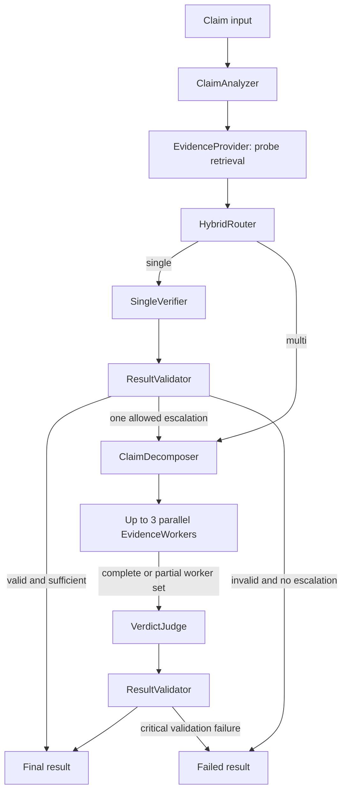

# EvidenceRoute：成本感知的自适应事实核查 Agent 设计规格

- 日期：2026-08-17
- 状态：书面规格已批准
- 改造基础：`agent-collab`（原仓库内重构，保留 Git 历史）
- 目标周期：两周

## 1. 背景与问题

现有 `agent-collab` 是一个手写 `asyncio` 编排的多 Agent 原型。它有可运行的测试和若干协作模式，但实现与 README 中的 LangGraph、A2A、标准 MCP、离线运行和审批 UI 等表述不一致。现有三题真实试跑还暴露了两个核心问题：

1. 评测器通过扫描自然语言中的标签关键词判断最终结论，可能把正文里的“证据不足”误当成最终标签。
2. 多 Agent 路径使用 468,040 Token，单 Agent 路径使用 42,853 Token，前者是后者的 10.92 倍，却没有可靠证据证明效果同步提升。

本次不继续扩展通用多 Agent 框架，而是将仓库收敛为一个可测量、可复现、可解释的事实核查 Agent：**EvidenceRoute**。项目的核心问题是：何时值得支付多 Agent 的额外成本，何时单 Agent 已足够。

## 2. 目标与非目标

### 2.1 目标

- 使用真实 LangGraph typed state、条件分支、并行任务和 checkpointing 实现完整工作流。
- 通过混合路由器在 `single` 和 `multi` 两条路径之间自适应选择。
- 对清晰样本使用确定性规则，仅对不确定样本调用结构化 LLM 路由。
- 所有最终判定使用 Pydantic 结构化字段，不再从自然语言扫描标签。
- Gate A 在 AVeriTeC 固定子集上比较 `always_single`、`always_multi`、`adaptive`；Gate B 再做独立中文案例研究。
- 同时报告质量、Token、估算成本、P50/P95 延迟、稳定性、路由分布和失败情况。
- 形成协议与 artifacts 可复跑的实验、可信 README、错误分析和可直接用于简历的实测数据；Gate B 再增加只读演示页。

### 2.2 非目标

- 不做通用 Deep Research 或开放式研究助理。
- 不实现长期记忆、写工具、人工审批、账号系统、数据库服务或云端部署。
- 不保留 pipeline、supervisor、debate 等与事实核查主线无关的模式。
- 不实现或宣称 A2A；LangGraph 负责图内状态和任务传递。
- 不把第三方中转返回的模型名称描述为官方 OpenAI 模型。
- 不以设计目标、少量手挑样本或最佳单次运行作为简历指标。

### 2.3 两周交付门禁

为避免再次出现“模块齐全但集成语义缺失”，交付分为两个顺序门禁：

**Gate A（两周硬交付）**只包含真实 LangGraph 图、结构化 contracts、`AveritecFrozenProvider`、三种策略、评测/报告 CLI、可观测 artifacts、离线测试与 CI。只有 Gate A 的端到端离线链路和固定 dev 子集评测通过后，才允许进入 Gate B。

**Gate B（增强交付）**包含 MCP live/record-replay provider、20 条中文案例和只读 Streamlit 页。它们保留在产品设计中，但不能阻塞或削弱 Gate A，也不能在未通过相应测试时出现在 README 或简历的已完成功能中。若两周内 Gate B 未完成，项目仍以公共基准核心版本交付，并在后续独立迭代中补齐。

## 3. 项目身份与迁移策略

- 产品名改为 **EvidenceRoute**。
- Python distribution 改为 `evidence-route`，导入包改为 `evidence_route`。
- 在当前仓库内完成重构并保留全部 Git 历史；原 `agent_collab` 包没有外部兼容性承诺，因此不增加兼容层。
- 删除旧版未兑现的 LangGraph、A2A、离线模式、标准 MCP、审批弹窗和通用协作框架表述。新 MCP 能力只有在官方 SDK 互操作测试通过后才重新写入 README。
- 原有代码仅保留可验证且仍适合新边界的实现；其余通过正常 Git 删除记录保留历史，不复制进新命名空间。
- 代码许可证和 AVeriTeC 数据许可证分别说明。AVeriTeC 采用 CC BY-NC 4.0，仓库只提交下载/准备脚本、固定清单和必要的小型测试 fixture，不把第三方数据重新声明为项目代码许可证。

## 4. 系统架构

LangGraph 是唯一工作流编排层。图使用 typed state，开发和测试使用内存 checkpoint，CLI/演示使用 SQLite checkpoint，以便在进程中断后检查和恢复一次运行。SQLite 只保存本地 LangGraph checkpoint，不承担业务数据库或服务职责。并行分解最多产生三个任务，单 Agent 路径最多升级一次，所有循环都有显式上限。

### 4.1 图状态

`VerificationState` 至少包含：

- `run_id`、`claim_id`、`claim_text`、`language`
- `claim_features`、`probe_evidence`
- `route_decision`、`route_reason_codes`
- `tasks`、`worker_results`
- `final_result`
- `escalation_count`
- `usage`、`node_timings`、`errors`
- `status`：`running | completed | partial | failed`

路由可观测字段区分初始选择和实际执行结果：路由已执行时 `initial_route` 为 `single | multi`，另用 `escalated: bool` 表示单路径是否升级。仅当 probe 在路由前失败且结果为带类型错误的 `failed` 时，`initial_route` 允许为 `null`、`failure_stage` 必须为 `pre_route`；报告将其单列为 `route_not_reached`，不伪造 single/multi，也不进入二者的路由分布分母。

### 4.2 最终输出

`VerificationResult` 是 Pydantic 模型，至少包含：

- `claim_id`
- `status`
- `verdict`：严格映射到 AVeriTeC 四个标签；仅 `failed` 状态允许为 `null`
- `confidence`：0 到 1 的模型自报置信度，不宣称经过统计校准；仅 `failed` 状态允许为 `null`
- `rationale`
- `citations`
- `initial_route`、`escalated`、`failure_stage`；仅路由前失败允许 `initial_route=null`
- `input_tokens`、`output_tokens`、`total_tokens`、`usage_complete`
- `estimated_cost`、`cost_currency`、`price_config_id`；usage 不完整时 cost 必须为 `null`
- `latency_ms`
- `errors`

四个判定标签为：

1. `Supported`
2. `Refuted`
3. `Not Enough Evidence`
4. `Conflicting Evidence/Cherrypicking`

每条 citation 必须引用当前运行中真实存在的 `evidence_id`，并包含 `question`、`answer`、最小 `quote` 和 `stance`。其中 question/answer 供 AVeriTeC 官方输出适配器使用。验证器拒绝不存在的引用、空依据的高置信度结论、状态与 verdict 不匹配以及无法映射的标签。

### 4.3 核心 contracts

- `ClaimFeatures`：`claim_units`、`atomic_clause_count`、`entity_count`、`numeric_count`、`time_scope_count`、`has_comparison`、`has_causal`、`has_contrast`、`probe_source_count`、`probe_score_spread`、`probe_conflict_hint`。所有字段来自 claim 文本和检索结果，不读取 gold 数据。
- `RouteDecision`：`route`、`source`（`rule | llm | fallback`）、枚举化 `reason_codes`、`explanation`、`config_hash`。
- `Citation`：`evidence_id`、`claim_unit_ids`、`question`、`answer`、`quote`、`stance`、`source_url`。
- `WorkerResult`：`task_id`、`claim_unit_ids`、`status`、`verdict`、`confidence`、`citations`、`usage`、`errors`。

这些模型禁止任意额外字段。枚举、长度和数值范围由 Pydantic 校验；任何用于路由或评分的派生值都必须能从保存的结构化字段重新计算。

## 5. 组件边界

### 5.1 `ClaimAnalyzer`

输入原始 claim，使用版本化的中英文分隔词、标点和正则规则形成 `claim_units`，并输出稳定、可记录的表面特征，例如长度、实体/数字/日期数量、并列或因果标记、时间限定、比较表达和复合命题信号。分割结果不确定时只设置特征并交给 LLM router，不在本步骤作最终事实判断。

### 5.2 `EvidenceProvider`

统一证据接口，支持：

- `AveritecFrozenProvider`：在固定版本的 AVeriTeC claim-specific knowledge store 上执行确定性 BM25 检索，运行时不联网。Agent 不能读取 gold label、gold evidence 标记或参考 justification。
- `McpLiveProvider`：通过官方 MCP Python SDK 连接配置的只读 search/fetch MCP server，用于收集中文现实案例证据和交互演示。
- `RecordedMcpProvider`：重放一次 MCP 收集后冻结的证据快照，用于中文三策略正式对比，避免运行顺序和网页变化污染结果。

统一证据对象包含 `evidence_id`、标题、URL、抓取时间、相关文本、provider、排序分数和 SHA-256 内容哈希。实时模式只保存完成判定所需的文本快照，并记录来源时间。

默认证据预算固定为：probe retrieval `top_k=3`、每条最多 450 字符；single retrieval `top_k=8`、每条最多 800 字符；每个 worker `top_k=5`、每条最多 800 字符；Judge 最多接收 12 条去重证据、每条最多 600 字符。截断保留原始快照哈希和字符区间，citation quote 最多 600 字符。所有上限均在 calibration 前写入配置，dev 运行后不得调整。

### 5.3 `HybridRouter`

路由分三层，规则优先级固定为 clear-multi、clear-single、uncertain：

1. 默认 clear-multi：`atomic_clause_count >= 3`，或至少两个 claim unit 且同时存在比较、多时间范围或 conflict hint，选择 `multi`。
2. 默认 clear-single：只有一个 claim unit，且不存在比较、因果、转折和 conflict hint，并且 probe retrieval 至少返回两个不同来源，选择 `single`。
3. 其余样本进入不确定区间，由 LLM 返回结构化 `RouteDecision`。

`conflict_hint` 只是基于同一实体/数值附近否定词和对立数字的确定性启发式信号，不被当作真实 verdict。规则只读取 `ClaimAnalyzer` 特征和 probe retrieval 的可观测信号。整数阈值、布尔条件和词表保存在版本化配置中，只允许使用 32 条 train calibration 样本选择；最终 dev 样本不能参与调参。

校准时先在 32 条样本上各运行一次 fixed single、fixed multi 和一次结构化 LLM router，再保存 single 的置信度、引用覆盖和可能的升级信号。之后通过 policy replay 搜索预先声明的有限阈值网格，不为每组阈值重复调用模型。选择规则为：先最大化 macro-F1，再在与最佳值相差不超过 3 个百分点的配置中最小化总 Token；仍相同时选择调用 LLM router 更少的配置。replay 的成本包含真实 router 调用以及按候选策略会发生的 single 后升级路径，不能只把 fixed single/multi 结果做零成本二选一。校准完成后冻结路由配置和 prompt，再接触 dev manifest。

LLM 路由输出包含 `route`、枚举化 `reason_codes` 和简短解释。若 JSON/Pydantic 解析失败，修复一次后仍失败，则回退到确定性保守规则并记录 `router_fallback`，不能自由生成第三种路径。

### 5.4 `SingleVerifier`

在一次有界验证流程中读取 claim 和证据，直接生成结构化判定。满足下列任一条件时可升级一次：

- 置信度低于版本化阈值；
- 证据存在结构化冲突；
- citation 校验失败且仍有可用检索预算；
- 复合命题覆盖不足。

默认低置信度阈值为 `0.65`；结构覆盖率定义为被有效 citation 引用的 `claim_unit_ids` 数量除以全部 claim units 数量，默认低于 `1.0` 视为不足。两者都可通过 calibration 修改并写入配置。覆盖率不读取 gold evidence。升级原因必须记录。升级后不得返回 single 路径或再次升级。

### 5.5 `ClaimDecomposer`

把 claim 分解为最多三个可独立核查的任务。每个任务必须保留与原 claim 的关系，并说明它对最终判定的作用。无有效分解时生成一个保底任务，而不是创建空并行图。

### 5.6 `EvidenceWorker`

每个 worker 只处理一个核查任务：检索证据、评价来源与命题的关系，并返回结构化 worker result。worker 之间不互相对话，不引入自定义 A2A 消息协议。LangGraph 的并行任务与 state reduction 负责汇合。

### 5.7 `VerdictJudge`

综合 worker results 生成一个 `VerificationResult`。Judge 只能引用 worker 返回的证据，不能补写不存在的来源。它必须区分“搜索基础设施失败”和“已正常搜索但证据不足”。

### 5.8 `ResultValidator`

执行纯结构化验证：标签、citation、状态、置信度范围、证据覆盖和使用量字段。它绝不从 `rationale` 中扫描标签关键词。基础设施失败不能静默转换成 `Not Enough Evidence`。

## 6. 数据流与运行模式

### 6.1 单次核查

1. CLI（Gate B 也可由 Streamlit）接收 claim，并生成 `run_id`。
2. ClaimAnalyzer 提取特征，EvidenceProvider 做小规模 probe retrieval。
3. HybridRouter 通过规则或结构化 LLM 决定路径。
4. single 路径直接判定；结果不充分时只升级一次。
5. multi 路径分解为最多三个任务并行核查，由 Judge 汇总。
6. ResultValidator 校验结构化结果和 citation。
7. 系统写入 trace、证据快照、usage 和最终结果，再向用户展示。

### 6.2 LLM provider

LLM 通过一个 provider-neutral adapter 调用 OpenAI-compatible API。运行配置从环境变量读取 base URL、API key 和请求模型名，仓库不硬编码中转地址或密钥。实验记录保存 `requested_alias`、中转响应自报的 `response_model_id_raw`、`identity_verified=false`、endpoint 配置哈希、`usage_source` 和 `price_source`。自报 model ID 只用于发现运行漂移，不能证明真实后端身份。

若服务支持原生 JSON schema，则优先使用；否则要求 JSON 输出并在本地用 Pydantic 验证。正式评测开始前必须通过一次 capability smoke test，确认结构化输出和 usage 字段存在。usage 缺失不能记为 0，也不能生成精确成本；严格评测在这种情况下停止。若同一活动中的 `response_model_id_raw` 发生变化，活动标记为 `incomplete_model_drift`，不同 ID 只能分组报告，不能合并。文档统一写为“OpenAI-compatible provider + relay-reported model ID (identity unverified)”，除非后续能验证官方来源，否则不使用“官方 OpenAI 模型”表述。

## 7. 评测设计

### 7.1 公共基准

采用 AVeriTeC：

- Train：3,068 条 claim
- Dev：500 条 claim
- 许可证：CC BY-NC 4.0
- 标签：四分类精确标签
- 官方指标：accuracy、macro-F1、QA/justification METEOR 和 evidence-aware veracity

从 train 固定抽取 32 条平衡样本用于路由校准，每类 8 条。从 dev 固定抽取 80 条平衡样本作为最终评测，每类 20 条。抽样 seed 固定为 `20260817`，生成包含原数据 ID、数据版本和哈希的 manifest；manifest 在模型运行前提交，禁止根据结果换题。

Agent 进程只读取 claim-only runtime manifest。gold label、gold QA 和 justification 位于 scorer 专用文件，由独立评分命令在推理完成后读取；检索索引的文件名、字段和 `evidence_id` 不编码 gold relevance。首次 dev 推理前必须提交 runtime manifest、prompt 和 config SHA。查看 dev 输出后的任何修改都使后续结果标记为 `exploratory`，不能替换首次冻结运行并继续称为一次性最终评测。

校准样本只用于选择路由规则、阈值和不确定区间。最终质量数字只来自 dev manifest。

所有公开结果必须写成 `AVeriTeC dev balanced subset (n=80)`，不能简称为 AVeriTeC 全量 dev 成绩、官方 leaderboard 成绩或完整 benchmark 成绩。官方 evaluator 仅表示复用其指标实现，不表示该子集结果获得官方认证。

### 7.2 中文现实案例

建立 20 条独立中文案例，每类 5 条。每条包含 claim、时间范围、gold verdict、来源 URL、最小证据摘录、标注理由、采集时间和内容哈希。先用 claim-only 查询冻结候选证据，再完成 gold 标注；gold label 和标注理由保存在评测侧，运行时不能提供给 Agent。

证据先通过 `McpLiveProvider` 收集，再冻结为与案例 manifest 绑定的只读快照。正式三策略对比统一使用 `RecordedMcpProvider`；实时 MCP 结果单独作为工程 smoke test 展示，不与冻结对比结果混算。

该集合明确称为“人工整理的中文案例研究”，不冒充公共 benchmark，也不作为泛化性能证据。若能获得第二位人工复核者，则记录一致率并对争议样本仲裁；若不能，报告必须明确单人标注限制。结果与 AVeriTeC 分开描述，不合并成一个更好看的总分。

### 7.3 对照策略

在相同 claim manifest、provider、模型、提示词版本和生成上限下运行：

- `always_single`
- `always_multi`
- `adaptive`

`always_single` 复用 SingleVerifier 但关闭升级；`always_multi` 直接进入分解、并行核查和 Judge；`adaptive` 启用 HybridRouter 和一次升级。三者复用相同路径组件，避免为基线另写一套更弱或更强的实现。

80 条 AVeriTeC dev 和 20 条中文案例都运行三种策略。另从 dev manifest 固定 20 条 stability subset，对 adaptive 总共运行三次；第一次可复用正式 adaptive 结果，额外执行两次。

执行器按 claim 交错三种策略，并使用 seed `20260817` 轮转每条 claim 的策略顺序，避免整批先跑某个策略造成 provider 负载偏差。P50/P95 使用 NumPy `quantile(method="linear")`；fresh-run latency 包含网络等待与重试，不包含人工暂停和 checkpoint 恢复期间的停机时间，cache hit 另行报告且不混入 fresh-run 延迟。

### 7.4 指标

报告分为三层，防止失败样本从指标中消失：

1. **全 manifest 惩罚指标**：内部 scorer 将 `partial`、`failed` 视为 `NO_PREDICTION`，对四个 gold 类别形成 false negative；accuracy、macro-F1 和每类指标以全部样本为分母。这是 README 和简历使用的主质量口径。
2. **完成样本条件指标**：只描述 `completed` 样本，同时强制并列展示 completion rate，不能单独引用。
3. **官方 evaluator 指标**：只把 schema 有效的 completed 输出交给 AVeriTeC evaluator，并与 completion rate、全 manifest 惩罚指标一起展示。不得为通过官方 schema 而给失败样本伪造一个合法 verdict。

每个策略至少报告：

- accuracy、macro-F1 和每类 precision/recall/F1
- AVeriTeC 官方 evidence-aware 指标
- 总 Token、每题平均 Token、输入/输出 Token
- 基于版本化价格配置计算的估算成本
- 端到端 P50/P95 latency
- 路由分布、升级比例、LLM router 调用比例
- `completed | partial | failed | not_run_budget | cancelled` 数量和失败原因
- citation 有效率

`not_run_budget` 和 `cancelled` 是 campaign 记录状态，不是模型预测状态；出现任一状态时 campaign 为 incomplete，不能发布为完整对照。稳定性定义为 20 条 stability subset 中三次运行标签完全一致的样本比例。

质量差异使用 claim-paired bootstrap（10,000 次、seed `20260817`）报告 95% 区间，稳定率同时报告 Wilson 95% 区间。由于 n=80 和 n=20 较小，3 个百分点与 85% 只作为工程门槛，不得描述为统计非劣性结论；中文案例只做描述性分析。

### 7.5 成功目标与发布规则

设计目标是：

- adaptive 相比 always-multi 总 Token 至少降低 40%；
- adaptive macro-F1 与两个固定策略中较好者相差不超过 3 个百分点；
- adaptive 三次标签完全一致率至少达到 85%。

这些是验收目标，不是预先写入简历的结果。若未达到，README 必须如实报告实际值和原因，不得挑选局部类别或单次运行代替整体结果。

正式评测的默认节点上限如下；输入上限包含 system prompt、claim、schema 和证据：

| 节点 | 单次最大输入 Token | 单次最大输出 Token | 单路径基础调用数 |
| --- | ---: | ---: | ---: |
| Router | 1,800 | 250 | adaptive 1 |
| SingleVerifier | 6,500 | 1,000 | single 1 |
| ClaimDecomposer | 2,500 | 500 | multi 1 |
| EvidenceWorker | 5,000 | 800 | multi 最多 3 |
| VerdictJudge | 8,000 | 1,200 | multi 1 |

按每次 multi 都使用三个 worker、每次 adaptive 都调用 LLM router 并从 single 升级到 multi 计算，无 repair/retry 的基础逻辑调用上界为：calibration `224` 次，80 条 dev 三策略 `1,040` 次，20 条 stability 额外两轮 `280` 次，因此 Gate A 合计 `1,544` 次；Gate B 的 20 条中文三策略再增加 `260` 次，完整 A+B 为 `1,804` 次。一次 repair 会产生新的逻辑调用，所有节点均 repair 时分别为 `3,088`/`3,608` 次；每个 HTTP 调用最多两次瞬态重试，理论传输尝试上界分别为 `9,264`/`10,824` 次。

运行器必须同时展示：上述无 repair/retry 的 `base_call_upper_bound`、所有结构化输出都 repair 的 `repair_upper_bound`，以及包含全部传输重试的 `fault_upper_bound`。三者按节点 token cap 和版本化 `price_source` 逐项计算，不能只用平均 Token 猜测。

人民币 350 元定义为客户端 `estimated_cost_cap_cny`，不是中转服务的真实额度硬限制。完整活动包含校准、最终三策略对比和稳定性复跑；启动条件是按当前 Gate 计算的 `base_call_upper_bound cost + 20% reserve <= 350`。每次请求前按该节点最大输入/输出预留成本，返回后用 provider usage 更新累计值，所有成功、repair 和可计费重试都计入。请求超时且无法确认 provider 是否计费时，成本只能标为 lower bound，严格活动暂停并等待 provider 账单核对，不能假定成本为 0。下一次预留会超过 350 时立即停止，剩余项记为 `not_run_budget`，campaign 标记 `incomplete_budget`，不得发布完整指标。若要继续，只能在首次正式运行前调整 token/task 上限或显式提高 cap，不能在看过结果后删减 manifest。

手工交互演示不计入该评测活动，但仍受独立的单次运行 cap。成本始终写作“基于中转 usage 与配置价格估算”；provider 账单是最终财务口径。

### 7.6 可复现记录

每次评测保存：

- Git SHA
- 数据版本、manifest 和 SHA-256
- `requested_alias`、`response_model_id_raw`、`identity_verified`
- provider 类型
- `usage_source`、`price_source` 和 endpoint 配置哈希
- 路由、模型、生成和预算配置哈希
- prompt 版本哈希
- 随机 seed
- 原始结构化结果和节点 trace
- Token、成本、延迟、路由与错误汇总

## 8. 异常处理

- LLM 和检索调用设置显式超时，瞬态错误最多重试两次，使用指数退避和 jitter。
- 认证错误、无效配置和预算超限不重试，直接失败并给出可操作错误。
- 结构化输出最多进行一次修复调用；再次失败后使用定义好的 fallback 或标记失败。
- single 最多升级一次；multi 最多三个 worker；每个节点和整图都有调用上限。
- worker 部分失败时，Judge 可以使用成功结果，但输出必须标记 `partial` 并列出失败任务。
- 无法完成关键检索或判定时输出 `failed`。评测中的 `partial` 和 `failed` 一律按错误计入质量指标，即使 partial 恰好生成与 gold 相同的标签；其预测标签只保留作诊断。
- 每个付费调用使用 `call_id = SHA256(run_id, node, task_id, logical_attempt)` 作为幂等键，并绑定完整非密钥请求的 SHA-256。调用生命周期按 `reserved -> sent -> completed | usage_missing | billing_uncertain` 原子持久化；已收到但缺少 usage 的响应保存在 `usage_missing` 终态，恢复时只能复用该响应并停止严格活动，不能重发或把成本记为 0。
- checkpoint 写入失败不改变已经持久化的事实判定，但必须记录为可观测错误。进程异常退出后遗留的 `RUNNING` 工作项在恢复入口先转换为可恢复状态，再检查 call store 与 checkpoint；无法确认 call cache 是否成功写入或 `sent` 是否计费时停止自动恢复，避免重复调用。最终 artifact 写入失败则命令返回非零退出码。
- worker 局部检索/调用错误转换为带类型错误的 `failed` worker；claim 级关键基础设施错误转换为零调用或已计费调用的 `failed` artifact。预算耗尽、usage 缺失、计费不确定和模型漂移属于活动级停止原因，不得伪装成普通预测失败。
- campaign 持久化枚举化停止原因及其优先级。模型漂移、usage 缺失或计费不确定只停止当前活动并保留未开始项，不能将其写成用户取消；`cancelled` 只允许由显式用户取消产生。
- 第三方模型即使接受 seed 也不保证位级确定性；“可复现”只表示数据、协议、配置和 artifacts 可复跑，不承诺生成文本完全一致。

## 9. 安全与隐私

- API key 仅从环境变量读取；`.env`、认证头和密钥值不进入 Git、trace 或错误信息。
- 网页和工具返回内容一律视为不可信数据，在提示词中作为带边界的 evidence，而不是系统指令。
- 只连接配置 allowlist 中受控的 MCP server，并只允许明确列出的 read-only search/fetch tools；不开放文件写入、shell、Python 执行或任意副作用工具。
- 客户端校验自身可见的 URL scheme、重定向、响应大小和超时，并拒绝本地文件、loopback 和私网目标；同时要求受控 MCP server 在服务端执行相同限制并通过互操作/SSRF 测试。客户端不宣称能约束任意第三方 server 的内部 fetch。
- trace 不保存隐藏 chain-of-thought，只保存结构化 reason codes、简短 rationale、工具输入输出摘要和错误。
- 中文案例只使用公开事实与公开来源，不收集私密数据；仓库只提交必要摘录与哈希，不镜像整站内容。

## 10. 可观测性

每个节点产生统一事件，至少包含：

- `run_id`、`claim_id`、节点名、开始/结束时间和状态
- initial route、escalation 和 reason codes
- provider、`requested_alias`、`response_model_id_raw`、`identity_verified`、重试次数
- 输入/输出/总 Token 和估算成本
- evidence IDs、工具错误和验证错误
- 节点 latency 与端到端 latency

checkpoint 恢复事件额外记录 call cache hit/miss、恢复前累计 usage 和停机时间。恢复后的 fresh calls 与复用 calls 分开统计，避免重复付费或把停机时间混入模型延迟。

单次 trace 使用 JSONL；单次结果使用 JSON；评测汇总同时生成 machine-readable JSON 和 Markdown。原始 trace 与报告通过同一个 `run_id` 关联。日志显示前自动过滤密钥、Authorization header 和已知敏感配置字段。

## 11. 测试策略

### 11.1 单元测试

- ClaimAnalyzer 特征提取和边界样本
- HybridRouter 规则优先级、不确定区间、LLM fallback
- Pydantic 输出解析和一次修复上限
- citation 存在性、重复引用和覆盖校验
- Token 聚合、价格计算和预算预检
- single 升级条件及升级次数上限
- verdict 映射与四分类混淆矩阵
- 原项目第三题“正文出现证据不足但最终标签为虚假”的回归用例

### 11.2 图级测试

使用 Fake LLM 和 Fake EvidenceProvider 验证：

- single 正常结束
- single 升级到 multi
- multi 三 worker 并行汇合
- worker 部分失败
- 路由 JSON 无效时 fallback
- checkpoint 恢复
- 预算耗尽和全局调用上限

### 11.3 集成与评测测试

- AVeriTeC frozen provider 的离线检索和固定 manifest 可重复。
- 官方 evaluator 可读取 completed 输出适配后的标签和 evidence schema；partial/failed 不通过伪造标签进入官方 evaluator。
- Gate B 的 MCP live provider 进行标准 `initialize`、`tools/list`、一次 read-only 调用、工具 allowlist 和 SSRF 负向 smoke test。
- OpenAI-compatible provider 的付费 smoke test 默认关闭，通过显式标记运行。
- CI 只运行确定性离线测试，不需要 API key 或网络。
- scorer 测试证明 runtime manifest 不含 gold 字段，`NO_PREDICTION` 会在全 manifest 指标中惩罚而不会被官方适配器伪造标签。
- budget/model identity 测试覆盖 usage 缺失、model ID 漂移、repair/retry 计费、运行中熔断和 incomplete campaign。
- checkpoint 测试证明相同 `call_id` 在恢复后命中 cache，不会重复调用 Fake LLM，并覆盖进程终止后持久化 `RUNNING` 状态以及 SQLite 已完成、artifact 尚未关闭的崩溃窗口。
- 分解测试证明 task ID 唯一且每个 claim-unit 引用有效，避免并行 worker 共享付费调用幂等键。

## 12. 用户界面与命令行

提供四个主要 CLI 命令：

- `verify`：核查单条 claim；Gate A 支持 frozen provider 和固定/adaptive 策略，Gate B 增加 live provider。
- `calibrate`：创建活动、收集 32 条 train artifacts，并在隔离 scorer 进程中 replay 冻结策略。
- `evaluate`：按 manifest 执行可恢复评测，执行前展示预算上界；正式 dev 首次运行必须通过显式“校准完成后进入 dev”阶段转换附着到同一活动，不能混同于崩溃恢复。
- `report`：从保存的 artifacts 重新生成统计和 Markdown，不重复调用模型。

Gate B 提供一个只读 Streamlit 演示页，展示 claim、最终标签、置信度、初始路由、是否升级、证据引用、Token、估算成本、延迟和错误。UI 不提供登录、写操作、审批或后台任务系统；其职责只是让面试官快速检查一条真实 trace。

## 13. 仓库交付物

Gate A 仓库至少包含：

- `src/evidence_route/`：contracts、graph、router、verifiers、providers、observability
- `configs/`：路由阈值、模型上限、价格和评测配置示例
- `data/manifests/`：冻结的 AVeriTeC calibration、dev 和 stability manifest
- `evals/`：评测运行器、官方适配器和报告生成器
- `tests/`：单元、图级、离线集成与回归测试
- `.env.example`：仅变量名和说明，不含任何真实值
- CI、依赖锁定、代码许可证和数据 attribution
- `reports/final/`：最终配置、汇总 JSON/Markdown、代表性 trace 和错误分析

Gate B 在此基础上增加中文案例 manifest、MCP record/replay fixtures 和 `app.py`。README 只包含已经通过门禁的能力；Gate A 至少包含真实架构图、快速开始、frozen 证据模式、三策略对比表、复现命令、成本口径、限制和失败分析，Gate B 通过后再增加 live 模式和中文案例。大体积原始数据由固定版本的准备脚本下载，不直接提交。

## 14. 验收标准

项目完成需同时满足：

1. 实现与 README 对 LangGraph、provider 和评测的描述一致；只有 Gate B 互操作测试通过后才允许声明 MCP。
2. 最终 verdict 只从结构化字段读取，旧关键词扫描缺陷有回归测试。
3. 三种策略在同一固定 manifest 上完成对照，失败样本没有从统计中消失。
4. 报告可追溯到 Git SHA、数据/配置/prompt hash、relay-reported model ID、未验证身份声明和原始 trace。
5. 默认 CI 无网络、无 API key 可通过；付费/live 测试明确 opt-in。
6. README 和简历只引用完整最终评测中实际达到的数字。
7. 若三项设计目标未全部达到，仓库仍发布诚实结果、误差来源和下一步，而不伪造成功叙事。
8. Gate A 未完成时不得用 Gate B 的 UI 或案例掩盖核心链路；Gate B 未完成时不得将其列为已交付能力。

## 15. 简历定位

EvidenceRoute 作为主项目，重点证明四件事：

- 能用 LangGraph 实现有边界、可恢复的 Agent 工作流；
- 能通过路由和预算约束处理质量与成本的工程权衡；
- 能设计无标签泄漏、固定样本、包含固定基线的可信评测；
- 能把 citation、模型身份、Token、延迟和失败情况做成可审计结果。

第二个简历项目保留并修复 `nju-campus-kb-rag`，定位为可评测的中文领域 RAG，而不是强行包装为 Agent。`research-agent` 和 `movie-recommender` 不进入 Agent/LLM 主简历。最终简历保留两个强项目即可，不为凑数量保留经不起追问的第三个项目。
